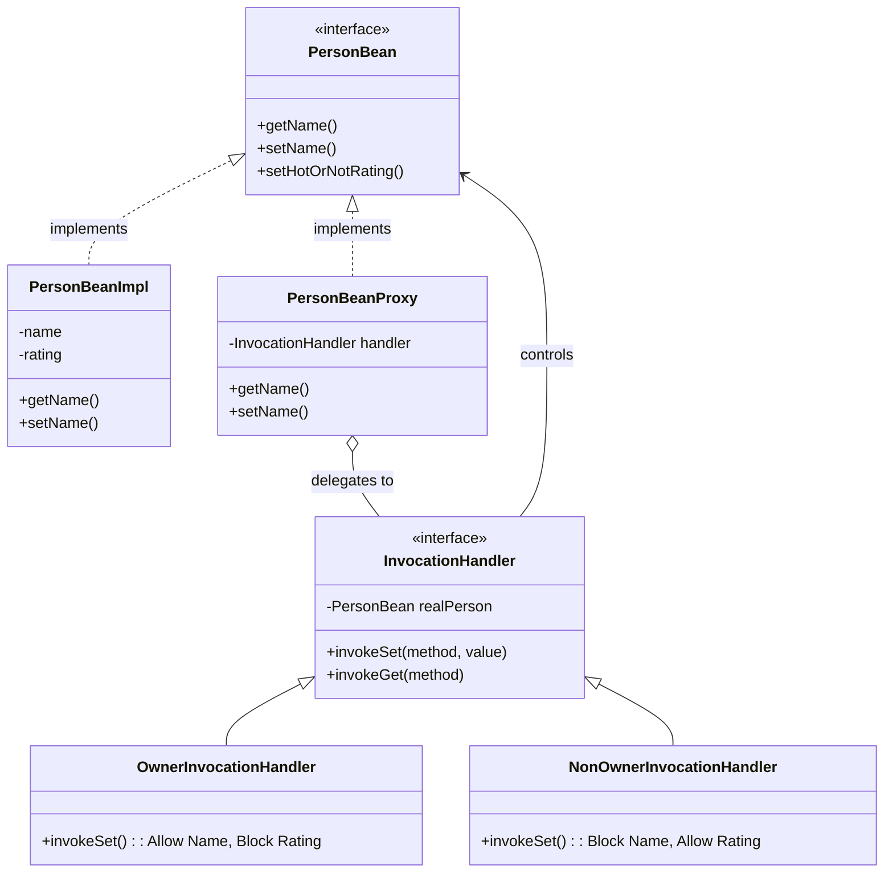

```mermaid
classDiagram
    %% 1. The Interface (The "Look")
    class PersonBean {
        <<interface>>
        +getName()
        +setName()
        +setHotOrNotRating()
    }

    %% 2. The Real Subject (The "Body")
    class PersonBeanImpl {
        -name
        -rating
        +getName()
        +setName()
    }

    %% 3. The Proxy (The "Face/Puppet")
    class PersonBeanProxy {
        -InvocationHandler handler
        +getName()
        +setName()
    }

    %% 4. The Handler Interface (The "Brain")
    class InvocationHandler {
        <<interface>>
        -PersonBean realPerson
        +invokeSet(method, value)
        +invokeGet(method)
    }

    %% 5. The Specific Rules (The "Rules")
    class OwnerInvocationHandler {
        +invokeSet() : Allow Name, Block Rating
    }
    class NonOwnerInvocationHandler {
        +invokeSet() : Block Name, Allow Rating
    }

    %% RELATIONSHIPS
    PersonBean <|.. PersonBeanImpl : implements
    PersonBean <|.. PersonBeanProxy : implements
    
    %% The Proxy HAS A Handler
    PersonBeanProxy o-- InvocationHandler : delegates to
    
    %% The Handler HAS A Real Person
    InvocationHandler --> PersonBean : controls

    %% Inheritance for Handlers
    InvocationHandler <|-- OwnerInvocationHandler
    InvocationHandler <|-- NonOwnerInvocationHandler
```